# FIELDed — Architecture Diagrams

**Status**: Current State Baseline  
**Last Updated**: 2026-09-24

---

## 1. System Context Diagram

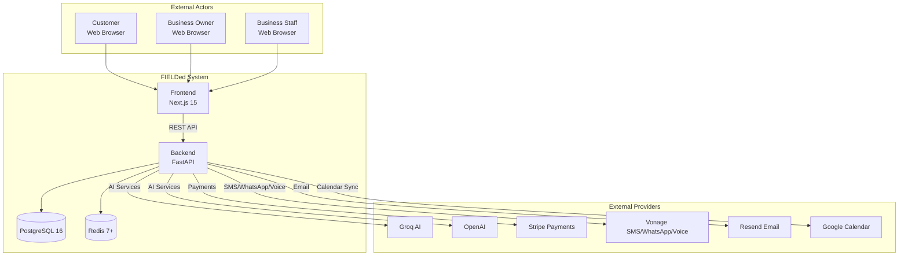
```mermaid
graph TB
    subgraph "External Actors"
        Customer[Customer<br/>Web Browser]
        BusinessOwner[Business Owner<br/>Web Browser]
        BusinessStaff[Business Staff<br/>Web Browser]
    end
    
    subgraph "FIELDed System"
        Frontend[Frontend<br/>Next.js 15]
        Backend[Backend<br/>FastAPI]
        Database[(PostgreSQL 16)]
        Redis[(Redis 7+)]
    end
    
    subgraph "External Providers"
        Groq[Groq AI]
        OpenAI[OpenAI]
        Stripe[Stripe Payments]
        Vonage[Vonage SMS/WhatsApp/Voice]
        Resend[Resend Email]
        GoogleCal[Google Calendar]
    end
    
    Customer --> Frontend
    BusinessOwner --> Frontend
    BusinessStaff --> Frontend
    
    Frontend -->|REST API| Backend
    Backend --> Database
    Backend --> Redis
    
    Backend -->|AI Services| Groq
    Backend -->|AI Services| OpenAI
    Backend -->|Payments| Stripe
    Backend -->|SMS/WhatsApp/Voice| Vonage
    Backend -->|Email| Resend
    Backend -->|Calendar Sync| GoogleCal
```

---

## 2. High-Level Application Architecture

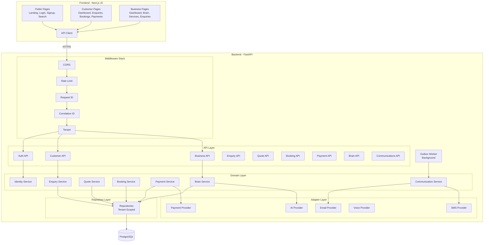
```mermaid
graph TB
    subgraph "Frontend - Next.js 15"
        PublicPages[Public Pages<br/>Landing, Login, Signup, Search]
        CustomerPages[Customer Pages<br/>Dashboard, Enquiries, Bookings, Payments]
        BusinessPages[Business Pages<br/>Dashboard, Brain, Services, Enquiries]
        APIClient[API Client]
    end
    
    subgraph "Backend - FastAPI"
        subgraph "Middleware Stack"
            CORS[CORS]
            RateLimit[Rate Limit]
            RequestID[Request ID]
            CorrelationID[Correlation ID]
            Tenant[Tenant]
        end
        
        subgraph "API Layer"
            AuthAPI[Auth API]
            CustomerAPI[Customer API]
            BusinessAPI[Business API]
            EnquiryAPI[Enquiry API]
            QuoteAPI[Quote API]
            BookingAPI[Booking API]
            PaymentAPI[Payment API]
            BrainAPI[Brain API]
            CommAPI[Communications API]
        end
        
        subgraph "Domain Layer"
            IdentityService[Identity Service]
            EnquiryService[Enquiry Service]
            QuoteService[Quote Service]
            BookingService[Booking Service]
            PaymentService[Payment Service]
            BrainService[Brain Service]
            CommService[Communication Service]
        end
        
        subgraph "Repository Layer"
            Repos[Repositories<br/>Tenant-Scoped]
        end
        
        subgraph "Adapter Layer"
            AIAdapter[AI Provider]
            EmailAdapter[Email Provider]
            SMSAdapter[SMS Provider]
            VoiceAdapter[Voice Provider]
            PaymentAdapter[Payment Provider]
        end
        
        OutboxWorker[Outbox Worker<br/>Background]
    end
    
    PublicPages --> APIClient
    CustomerPages --> APIClient
    BusinessPages --> APIClient
    
    APIClient -->|HTTPS| CORS
    CORS --> RateLimit
    RateLimit --> RequestID
    RequestID --> CorrelationID
    CorrelationID --> Tenant
    
    Tenant --> AuthAPI
    Tenant --> CustomerAPI
    Tenant --> BusinessAPI
    
    AuthAPI --> IdentityService
    CustomerAPI --> EnquiryService
    BusinessAPI --> BrainService
    
    EnquiryService --> Repos
    QuoteService --> Repos
    BookingService --> Repos
    PaymentService --> Repos
    BrainService --> Repos
    
    Repos --> Database[(PostgreSQL)]
    
    PaymentService --> PaymentAdapter
    BrainService --> AIAdapter
    CommService --> EmailAdapter
    CommService --> SMSAdapter
    
    OutboxWorker --> CommService
```

---

## 3. Frontend Architecture

```mermaid
graph TB
    subgraph "Public Routes (public)"
        Landing[Landing Page<br/>/]
        Login[Login<br/>/login]
        Signup[Signup<br/>/signup]
        Search[Search<br/>/search]
        Network[Network<br/>/network]
        BusinessProfile[Business Profile<br/>/business/:slug]
    end
    
    subgraph "Customer Routes (customer)"
        CustomerDashboard[Dashboard<br/>/customer/dashboard]
        CustomerEnquiries[Enquiries<br/>/customer/enquiries]
        CustomerBookings[Bookings<br/>/customer/bookings]
        CustomerQuotes[Quotes<br/>/customer/quotes]
        CustomerPayments[Payments<br/>/customer/payments]
        CustomerProfile[Profile<br/>/customer/profile]
    end
    
    subgraph "Business Routes (business)"
        BusinessDashboard[Dashboard<br/>/business/dashboard]
        BusinessBrain[Brain<br/>/business/brain]
        BusinessServices[Services<br/>/business/services]
        BusinessEnquiries[Enquiries<br/>/business/enquiries]
        BusinessBookings[Bookings<br/>/business/bookings]
        BusinessQuotes[Quotes<br/>/business/quotes]
        BusinessPayments[Payments<br/>/business/payments]
        BusinessSettings[Settings<br/>/business/settings]
    end
    
    subgraph "Shared Components"
        Navigation[Navigation]
        UILibrary[UI Library<br/>Button, Card, Input, etc.]
        APIClient[API Client]
    end
    
    Landing --> APIClient
    Login --> APIClient
    CustomerDashboard --> APIClient
    BusinessDashboard --> APIClient
    
    APIClient -->|REST API| Backend[Backend API]
```

---

## 4. Backend Domain Architecture

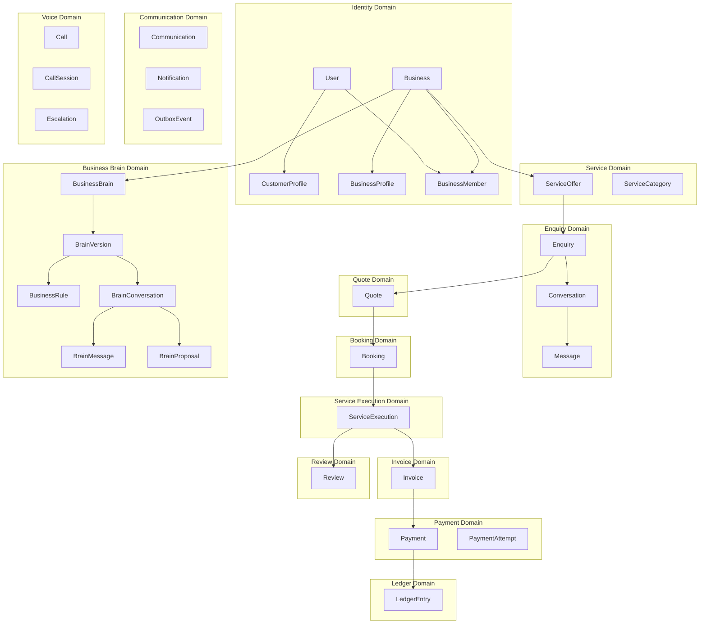
```mermaid
graph TB
    subgraph "Identity Domain"
        User[User]
        CustomerProfile[CustomerProfile]
        Business[Business]
        BusinessProfile[BusinessProfile]
        BusinessMember[BusinessMember]
    end
    
    subgraph "Service Domain"
        ServiceOffer[ServiceOffer]
        ServiceCategory[ServiceCategory]
    end
    
    subgraph "Enquiry Domain"
        Enquiry[Enquiry]
        Conversation[Conversation]
        Message[Message]
    end
    
    subgraph "Quote Domain"
        Quote[Quote]
    end
    
    subgraph "Booking Domain"
        Booking[Booking]
    end
    
    subgraph "Payment Domain"
        Payment[Payment]
        PaymentAttempt[PaymentAttempt]
    end
    
    subgraph "Invoice Domain"
        Invoice[Invoice]
    end
    
    subgraph "Ledger Domain"
        LedgerEntry[LedgerEntry]
    end
    
    subgraph "Service Execution Domain"
        ServiceExecution[ServiceExecution]
    end
    
    subgraph "Review Domain"
        Review[Review]
    end
    
    subgraph "Business Brain Domain"
        BusinessBrain[BusinessBrain]
        BrainVersion[BrainVersion]
        BusinessRule[BusinessRule]
        BrainConversation[BrainConversation]
        BrainMessage[BrainMessage]
        BrainProposal[BrainProposal]
    end
    
    subgraph "Communication Domain"
        Communication[Communication]
        Notification[Notification]
        OutboxEvent[OutboxEvent]
    end
    
    subgraph "Voice Domain"
        Call[Call]
        CallSession[CallSession]
        Escalation[Escalation]
    end
    
    User --> CustomerProfile
    User --> BusinessMember
    Business --> BusinessProfile
    Business --> BusinessMember
    Business --> ServiceOffer
    
    ServiceOffer --> Enquiry
    Enquiry --> Conversation
    Conversation --> Message
    
    Enquiry --> Quote
    Quote --> Booking
    Booking --> ServiceExecution
    ServiceExecution --> Invoice
    Invoice --> Payment
    Payment --> LedgerEntry
    ServiceExecution --> Review
    
    Business --> BusinessBrain
    BusinessBrain --> BrainVersion
    BrainVersion --> BusinessRule
    BrainVersion --> BrainConversation
    BrainConversation --> BrainMessage
    BrainConversation --> BrainProposal
```

---

## 5. Database/Entity Architecture

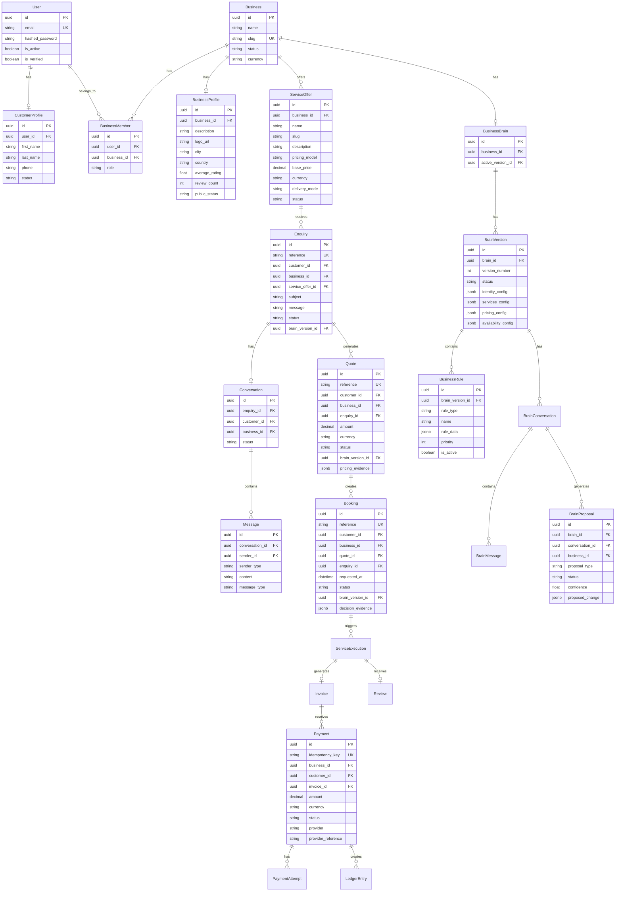
```mermaid
erDiagram
    User ||--o| CustomerProfile : has
    User ||--o{ BusinessMember : belongs_to
    Business ||--o| BusinessProfile : has
    Business ||--o{ BusinessMember : has
    Business ||--o{ ServiceOffer : offers
    Business ||--o| BusinessBrain : has
    
    ServiceOffer ||--o{ Enquiry : receives
    Enquiry ||--o| Conversation : has
    Conversation ||--o{ Message : contains
    
    Enquiry ||--o{ Quote : generates
    Quote ||--o{ Booking : creates
    Booking ||--o{ ServiceExecution : triggers
    ServiceExecution ||--o| Invoice : generates
    Invoice ||--o{ Payment : receives
    Payment ||--o{ PaymentAttempt : has
    Payment ||--o{ LedgerEntry : creates
    
    ServiceExecution ||--o| Review : receives
    
    BusinessBrain ||--o{ BrainVersion : has
    BrainVersion ||--o{ BusinessRule : contains
    BrainVersion ||--o{ BrainConversation : has
    BrainConversation ||--o{ BrainMessage : contains
    BrainConversation ||--o{ BrainProposal : generates
    
    User {
        uuid id PK
        string email UK
        string hashed_password
        boolean is_active
        boolean is_verified
    }
    
    CustomerProfile {
        uuid id PK
        uuid user_id FK
        string first_name
        string last_name
        string phone
        string status
    }
    
    Business {
        uuid id PK
        string name
        string slug UK
        string status
        string currency
    }
    
    BusinessProfile {
        uuid id PK
        uuid business_id FK
        string description
        string logo_url
        string city
        string country
        float average_rating
        int review_count
        string public_status
    }
    
    BusinessMember {
        uuid id PK
        uuid user_id FK
        uuid business_id FK
        string role
    }
    
    ServiceOffer {
        uuid id PK
        uuid business_id FK
        string name
        string slug
        string description
        string pricing_model
        decimal base_price
        string currency
        string delivery_mode
        string status
    }
    
    Enquiry {
        uuid id PK
        string reference UK
        uuid customer_id FK
        uuid business_id FK
        uuid service_offer_id FK
        string subject
        string message
        string status
        uuid brain_version_id FK
    }
    
    Conversation {
        uuid id PK
        uuid enquiry_id FK
        uuid customer_id FK
        uuid business_id FK
        string status
    }
    
    Message {
        uuid id PK
        uuid conversation_id FK
        uuid sender_id FK
        string sender_type
        string content
        string message_type
    }
    
    Quote {
        uuid id PK
        string reference UK
        uuid customer_id FK
        uuid business_id FK
        uuid enquiry_id FK
        decimal amount
        string currency
        string status
        uuid brain_version_id FK
        jsonb pricing_evidence
    }
    
    Booking {
        uuid id PK
        string reference UK
        uuid customer_id FK
        uuid business_id FK
        uuid quote_id FK
        uuid enquiry_id FK
        datetime requested_at
        string status
        uuid brain_version_id FK
        jsonb decision_evidence
    }
    
    Payment {
        uuid id PK
        string idempotency_key UK
        uuid business_id FK
        uuid customer_id FK
        uuid invoice_id FK
        decimal amount
        string currency
        string status
        string provider
        string provider_reference
    }
    
    BusinessBrain {
        uuid id PK
        uuid business_id FK
        uuid active_version_id FK
    }
    
    BrainVersion {
        uuid id PK
        uuid brain_id FK
        int version_number
        string status
        jsonb identity_config
        jsonb services_config
        jsonb pricing_config
        jsonb availability_config
    }
    
    BusinessRule {
        uuid id PK
        uuid brain_version_id FK
        string rule_type
        string name
        jsonb rule_data
        int priority
        boolean is_active
    }
    
    BrainProposal {
        uuid id PK
        uuid brain_id FK
        uuid conversation_id FK
        uuid business_id FK
        string proposal_type
        string status
        float confidence
        jsonb proposed_change
    }
```

---

## 6. API Architecture

```mermaid
graph TB
    subgraph "API Routes"
        HealthAPI[/health]
        AuthAPI[/auth/*]
        CustomerAPI[/customer/*]
        BusinessAPI[/businesses/*]
        CategoriesAPI[/categories/*]
        PublicAPI[/public/*]
        DiscoveryAPI[/discovery/*]
        EnquiriesAPI[/enquiries/*]
        CommunicationsAPI[/communications/*]
        VoiceAPI[/voice/*]
        PaymentsAPI[/payments/*]
        ReviewsAPI[/reviews/*]
    end
    
    subgraph "Business Sub-Routes"
        BusinessEnquiries[/businesses/:id/enquiries]
        BusinessBrain[/businesses/:id/brain]
        BusinessBrainConv[/businesses/:id/brain-conversations]
        BusinessQuotes[/businesses/:id/quotes]
        BusinessBookings[/businesses/:id/bookings]
        BusinessPayments[/businesses/:id/payments]
        BusinessLedger[/businesses/:id/ledger]
    end
    
    Client[Client] --> HealthAPI
    Client --> AuthAPI
    Client --> CustomerAPI
    Client --> BusinessAPI
    Client --> CategoriesAPI
    Client --> PublicAPI
    Client --> DiscoveryAPI
    Client --> EnquiriesAPI
    Client --> CommunicationsAPI
    Client --> VoiceAPI
    Client --> PaymentsAPI
    Client --> ReviewsAPI
    
    BusinessAPI --> BusinessEnquiries
    BusinessAPI --> BusinessBrain
    BusinessAPI --> BusinessBrainConv
    BusinessAPI --> BusinessQuotes
    BusinessAPI --> BusinessBookings
    BusinessAPI --> BusinessPayments
    BusinessAPI --> BusinessLedger
```

---

## 7. AI Provider Architecture

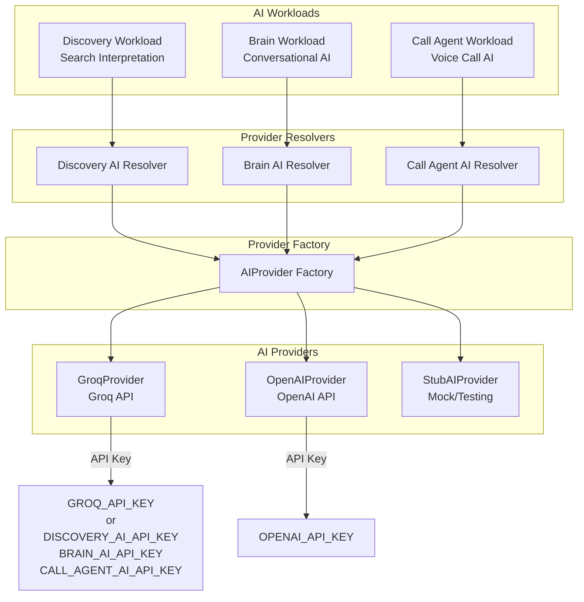
```mermaid
graph TB
    subgraph "AI Workloads"
        DiscoveryWorkload[Discovery Workload<br/>Search Interpretation]
        BrainWorkload[Brain Workload<br/>Conversational AI]
        CallAgentWorkload[Call Agent Workload<br/>Voice Call AI]
    end
    
    subgraph "Provider Resolvers"
        DiscoveryResolver[Discovery AI Resolver]
        BrainResolver[Brain AI Resolver]
        CallAgentResolver[Call Agent AI Resolver]
    end
    
    subgraph "Provider Factory"
        AIProviderFactory[AIProvider Factory]
    end
    
    subgraph "AI Providers"
        GroqProvider[GroqProvider<br/>Groq API]
        OpenAIProvider[OpenAIProvider<br/>OpenAI API]
        StubProvider[StubAIProvider<br/>Mock/Testing]
    end
    
    DiscoveryWorkload --> DiscoveryResolver
    BrainWorkload --> BrainResolver
    CallAgentWorkload --> CallAgentResolver
    
    DiscoveryResolver --> AIProviderFactory
    BrainResolver --> AIProviderFactory
    CallAgentResolver --> AIProviderFactory
    
    AIProviderFactory --> GroqProvider
    AIProviderFactory --> OpenAIProvider
    AIProviderFactory --> StubProvider
    
    GroqProvider -->|API Key| GroqConfig[GROQ_API_KEY<br/>or<br/>DISCOVERY_AI_API_KEY<br/>BRAIN_AI_API_KEY<br/>CALL_AGENT_AI_API_KEY]
    OpenAIProvider -->|API Key| OpenAIConfig[OPENAI_API_KEY]
```

---

## 8. Business Brain Architecture

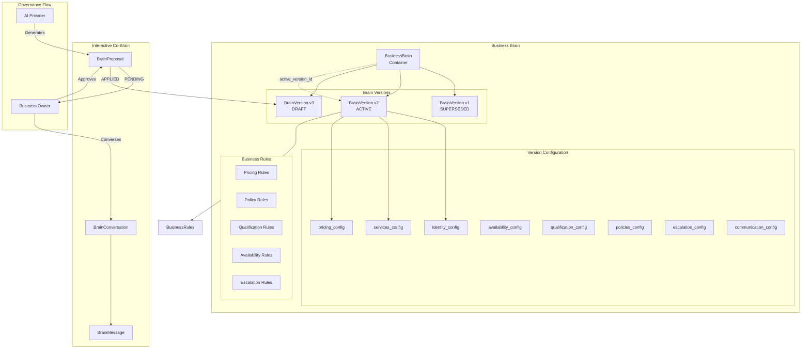
```mermaid
graph TB
    subgraph "Business Brain"
        BusinessBrain[BusinessBrain<br/>Container]
        
        subgraph "Brain Versions"
            BrainVersion1[BrainVersion v1<br/>SUPERSEDED]
            BrainVersion2[BrainVersion v2<br/>ACTIVE]
            BrainVersion3[BrainVersion v3<br/>DRAFT]
        end
        
        subgraph "Version Configuration"
            IdentityConfig[identity_config]
            ServicesConfig[services_config]
            PricingConfig[pricing_config]
            AvailabilityConfig[availability_config]
            QualificationConfig[qualification_config]
            PoliciesConfig[policies_config]
            EscalationConfig[escalation_config]
            CommunicationConfig[communication_config]
        end
        
        subgraph "Business Rules"
            PricingRules[Pricing Rules]
            PolicyRules[Policy Rules]
            QualificationRules[Qualification Rules]
            AvailabilityRules[Availability Rules]
            EscalationRules[Escalation Rules]
        end
    end
    
    subgraph "Interactive Co-Brain"
        BrainConversation[BrainConversation]
        BrainMessage[BrainMessage]
        BrainProposal[BrainProposal]
    end
    
    subgraph "Governance Flow"
        Owner[Business Owner]
        AI[AI Provider]
        
        Owner -->|Converses| BrainConversation
        BrainConversation --> BrainMessage
        AI -->|Generates| BrainProposal
        BrainProposal -->|PENDING| Owner
        Owner -->|Approves| BrainProposal
        BrainProposal -->|APPLIED| BrainVersion3
    end
    
    BusinessBrain --> BrainVersion1
    BusinessBrain --> BrainVersion2
    BusinessBrain --> BrainVersion3
    
    BrainVersion2 --> IdentityConfig
    BrainVersion2 --> ServicesConfig
    BrainVersion2 --> PricingConfig
    BrainVersion2 --> BusinessRules
    
    BusinessBrain -.->|active_version_id| BrainVersion2
```

---

## 9. Enquiry → Quote → Booking → Payment → Service Lifecycle

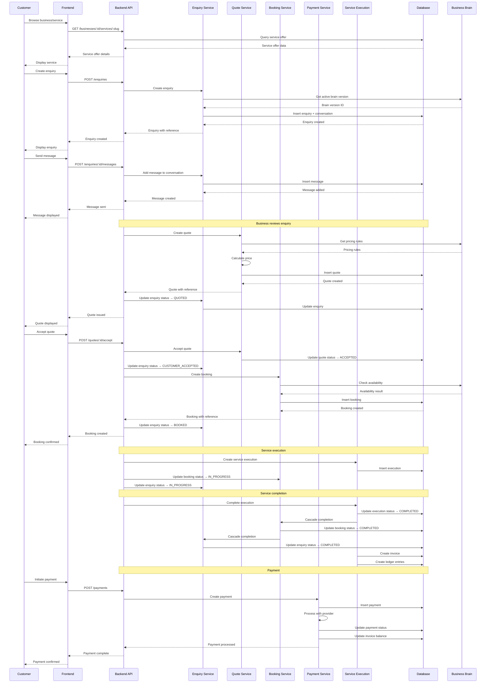
```mermaid
sequenceDiagram
    participant C as Customer
    participant F as Frontend
    participant B as Backend API
    participant E as Enquiry Service
    participant Q as Quote Service
    participant Bo as Booking Service
    participant P as Payment Service
    participant SE as Service Execution
    participant DB as Database
    participant Brain as Business Brain
    
    C->>F: Browse business/service
    F->>B: GET /businesses/:id/services/:slug
    B->>DB: Query service offer
    DB-->>B: Service offer data
    B-->>F: Service offer details
    F-->>C: Display service
    
    C->>F: Create enquiry
    F->>B: POST /enquiries
    B->>E: Create enquiry
    E->>Brain: Get active brain version
    Brain-->>E: Brain version ID
    E->>DB: Insert enquiry + conversation
    DB-->>E: Enquiry created
    E-->>B: Enquiry with reference
    B-->>F: Enquiry created
    F-->>C: Display enquiry
    
    C->>F: Send message
    F->>B: POST /enquiries/:id/messages
    B->>E: Add message to conversation
    E->>DB: Insert message
    DB-->>E: Message added
    E-->>B: Message created
    B-->>F: Message sent
    F-->>C: Message displayed
    
    Note over B,DB: Business reviews enquiry
    
    B->>Q: Create quote
    Q->>Brain: Get pricing rules
    Brain-->>Q: Pricing rules
    Q->>Q: Calculate price
    Q->>DB: Insert quote
    DB-->>Q: Quote created
    Q-->>B: Quote with reference
    B->>E: Update enquiry status → QUOTED
    E->>DB: Update enquiry
    B-->>F: Quote issued
    F-->>C: Quote displayed
    
    C->>F: Accept quote
    F->>B: POST /quotes/:id/accept
    B->>Q: Accept quote
    Q->>DB: Update quote status → ACCEPTED
    B->>E: Update enquiry status → CUSTOMER_ACCEPTED
    B->>Bo: Create booking
    Bo->>Brain: Check availability
    Brain-->>Bo: Availability result
    Bo->>DB: Insert booking
    DB-->>Bo: Booking created
    Bo-->>B: Booking with reference
    B->>E: Update enquiry status → BOOKED
    B-->>F: Booking created
    F-->>C: Booking confirmed
    
    Note over B,DB: Service execution
    
    B->>SE: Create service execution
    SE->>DB: Insert execution
    B->>Bo: Update booking status → IN_PROGRESS
    B->>E: Update enquiry status → IN_PROGRESS
    
    Note over B,DB: Service completion
    
    B->>SE: Complete execution
    SE->>DB: Update execution status → COMPLETED
    SE->>Bo: Cascade completion
    Bo->>DB: Update booking status → COMPLETED
    Bo->>E: Cascade completion
    E->>DB: Update enquiry status → COMPLETED
    SE->>DB: Create invoice
    SE->>DB: Create ledger entries
    
    Note over B,DB: Payment
    
    C->>F: Initiate payment
    F->>B: POST /payments
    B->>P: Create payment
    P->>DB: Insert payment
    P->>P: Process with provider
    P->>DB: Update payment status
    P->>DB: Update invoice balance
    P-->>B: Payment processed
    B-->>F: Payment complete
    F-->>C: Payment confirmed
```

---

## 10. Event/Outbox/Notification Architecture

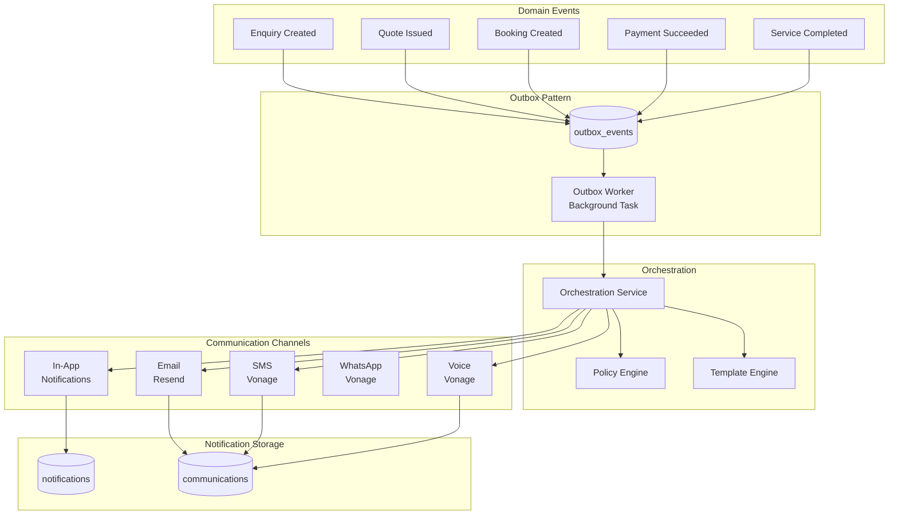
```mermaid
graph TB
    subgraph "Domain Events"
        EnquiryCreated[Enquiry Created]
        QuoteIssued[Quote Issued]
        BookingCreated[Booking Created]
        PaymentSucceeded[Payment Succeeded]
        ServiceCompleted[Service Completed]
    end
    
    subgraph "Outbox Pattern"
        OutboxTable[(outbox_events)]
        OutboxWorker[Outbox Worker<br/>Background Task]
    end
    
    subgraph "Orchestration"
        OrchestrationService[Orchestration Service]
        PolicyEngine[Policy Engine]
        TemplateEngine[Template Engine]
    end
    
    subgraph "Communication Channels"
        EmailChannel[Email<br/>Resend]
        SMSChannel[SMS<br/>Vonage]
        VoiceChannel[Voice<br/>Vonage]
        WhatsAppChannel[WhatsApp<br/>Vonage]
        InAppChannel[In-App<br/>Notifications]
    end
    
    subgraph "Notification Storage"
        NotificationsTable[(notifications)]
        CommunicationsTable[(communications)]
    end
    
    EnquiryCreated --> OutboxTable
    QuoteIssued --> OutboxTable
    BookingCreated --> OutboxTable
    PaymentSucceeded --> OutboxTable
    ServiceCompleted --> OutboxTable
    
    OutboxTable --> OutboxWorker
    OutboxWorker --> OrchestrationService
    
    OrchestrationService --> PolicyEngine
    OrchestrationService --> TemplateEngine
    
    OrchestrationService --> EmailChannel
    OrchestrationService --> SMSChannel
    OrchestrationService --> VoiceChannel
    OrchestrationService --> InAppChannel
    
    EmailChannel --> CommunicationsTable
    SMSChannel --> CommunicationsTable
    VoiceChannel --> CommunicationsTable
    InAppChannel --> NotificationsTable
```

---

## 11. Authentication/Authorization Architecture

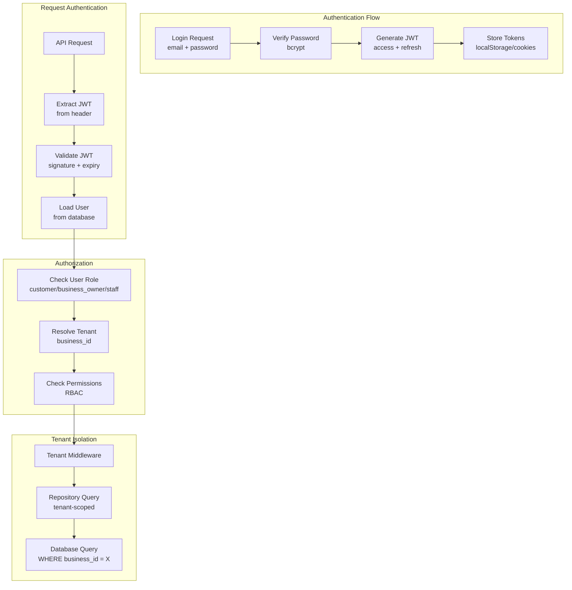
```mermaid
graph TB
    subgraph "Authentication Flow"
        Login[Login Request<br/>email + password]
        PasswordVerify[Verify Password<br/>bcrypt]
        TokenGenerate[Generate JWT<br/>access + refresh]
        TokenStore[Store Tokens<br/>localStorage/cookies]
    end
    
    subgraph "Request Authentication"
        APIRequest[API Request]
        TokenExtract[Extract JWT<br/>from header]
        TokenValidate[Validate JWT<br/>signature + expiry]
        UserLoad[Load User<br/>from database]
    end
    
    subgraph "Authorization"
        RoleCheck[Check User Role<br/>customer/business_owner/staff]
        TenantResolve[Resolve Tenant<br/>business_id]
        PermissionCheck[Check Permissions<br/>RBAC]
    end
    
    subgraph "Tenant Isolation"
        TenantMiddleware[Tenant Middleware]
        RepositoryQuery[Repository Query<br/>tenant-scoped]
        DatabaseQuery[Database Query<br/>WHERE business_id = X]
    end
    
    Login --> PasswordVerify
    PasswordVerify --> TokenGenerate
    TokenGenerate --> TokenStore
    
    APIRequest --> TokenExtract
    TokenExtract --> TokenValidate
    TokenValidate --> UserLoad
    UserLoad --> RoleCheck
    RoleCheck --> TenantResolve
    TenantResolve --> PermissionCheck
    
    PermissionCheck --> TenantMiddleware
    TenantMiddleware --> RepositoryQuery
    RepositoryQuery --> DatabaseQuery
```

---

## 12. Deployment Architecture

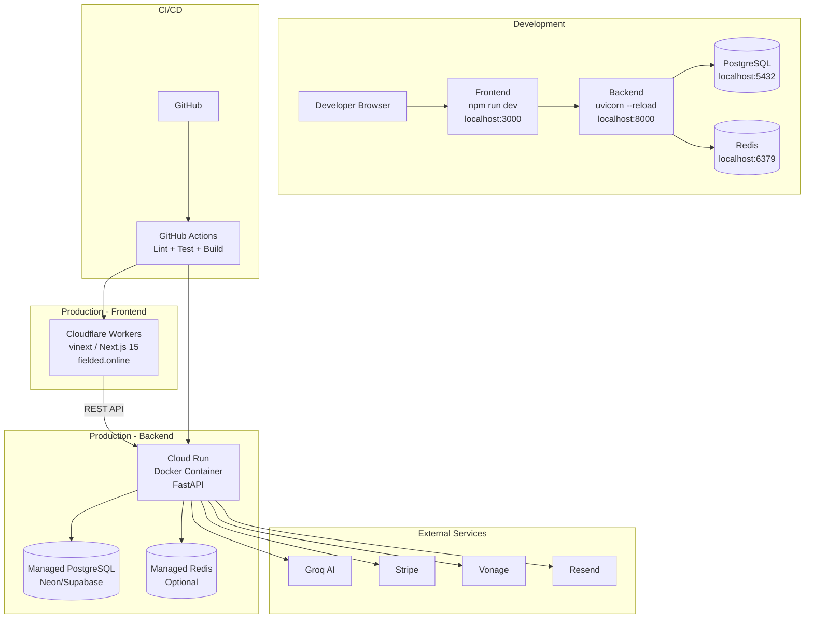
```mermaid
graph TB
    subgraph "Development"
        DevBrowser[Developer Browser]
        DevFrontend[Frontend<br/>npm run dev<br/>localhost:3000]
        DevBackend[Backend<br/>uvicorn --reload<br/>localhost:8000]
        DevDB[(PostgreSQL<br/>localhost:5432)]
        DevRedis[(Redis<br/>localhost:6379)]
    end
    
    subgraph "Production - Frontend"
        CFWorkers[Cloudflare Workers<br/>vinext / Next.js 15<br/>fielded.online]
    end
    
    subgraph "Production - Backend"
        CloudRun[Cloud Run<br/>Docker Container<br/>FastAPI]
        ManagedDB[(Managed PostgreSQL<br/>Neon/Supabase)]
        ManagedRedis[(Managed Redis<br/>Optional)]
    end
    
    subgraph "External Services"
        Groq[Groq AI]
        Stripe[Stripe]
        Vonage[Vonage]
        Resend[Resend]
    end
    
    subgraph "CI/CD"
        GitHub[GitHub]
        GitHubActions[GitHub Actions<br/>Lint + Test + Build]
    end
    
    DevBrowser --> DevFrontend
    DevFrontend --> DevBackend
    DevBackend --> DevDB
    DevBackend --> DevRedis
    
    CFWorkers -->|REST API| CloudRun
    CloudRun --> ManagedDB
    CloudRun --> ManagedRedis
    
    CloudRun --> Groq
    CloudRun --> Stripe
    CloudRun --> Vonage
    CloudRun --> Resend
    
    GitHub --> GitHubActions
    GitHubActions --> CFWorkers
    GitHubActions --> CloudRun
```

---

## 13. External Integrations Architecture

```mermaid
graph TB
    subgraph "FIELDed Backend"
        ProviderFactory[Provider Factory]
    end
    
    subgraph "AI Providers"
        GroqAdapter[Groq Adapter]
        OpenAIAdapter[OpenAI Adapter]
        StubAIAdapter[Stub AI Adapter]
    end
    
    subgraph "Communication Providers"
        ResendAdapter[Resend Adapter<br/>Email]
        VonageSMSAdapter[Vonage Adapter<br/>SMS]
        VonageVoiceAdapter[Vonage Adapter<br/>Voice]
        VonageWhatsAppAdapter[Vonage Adapter<br/>WhatsApp]
        StubPushAdapter[Stub Adapter<br/>Push]
    end
    
    subgraph "Payment Providers"
        StripeAdapter[Stripe Adapter]
        StubPaymentAdapter[Stub Payment Adapter]
    end
    
    subgraph "Calendar Providers"
        GoogleCalendarAdapter[Google Calendar Adapter]
    end
    
    subgraph "External Services"
        Groq[Groq API]
        OpenAI[OpenAI API]
        Resend[Resend API]
        Vonage[Vonage API]
        Stripe[Stripe API]
        GoogleCalendar[Google Calendar API]
    end
    
    ProviderFactory --> GroqAdapter
    ProviderFactory --> OpenAIAdapter
    ProviderFactory --> StubAIAdapter
    
    ProviderFactory --> ResendAdapter
    ProviderFactory --> VonageSMSAdapter
    ProviderFactory --> VonageVoiceAdapter
    ProviderFactory --> VonageWhatsAppAdapter
    ProviderFactory --> StubPushAdapter
    ProviderFactory --> GoogleCalendarAdapter
    
    ProviderFactory --> StripeAdapter
    ProviderFactory --> StubPaymentAdapter
    
    GroqAdapter --> Groq
    OpenAIAdapter --> OpenAI
    ResendAdapter --> Resend
    VonageSMSAdapter --> Vonage
    VonageVoiceAdapter --> Vonage
    VonageWhatsAppAdapter --> Vonage
    GoogleCalendarAdapter --> GoogleCalendar
    StripeAdapter --> Stripe
```

---

## State Machine Diagrams

### Enquiry State Machine

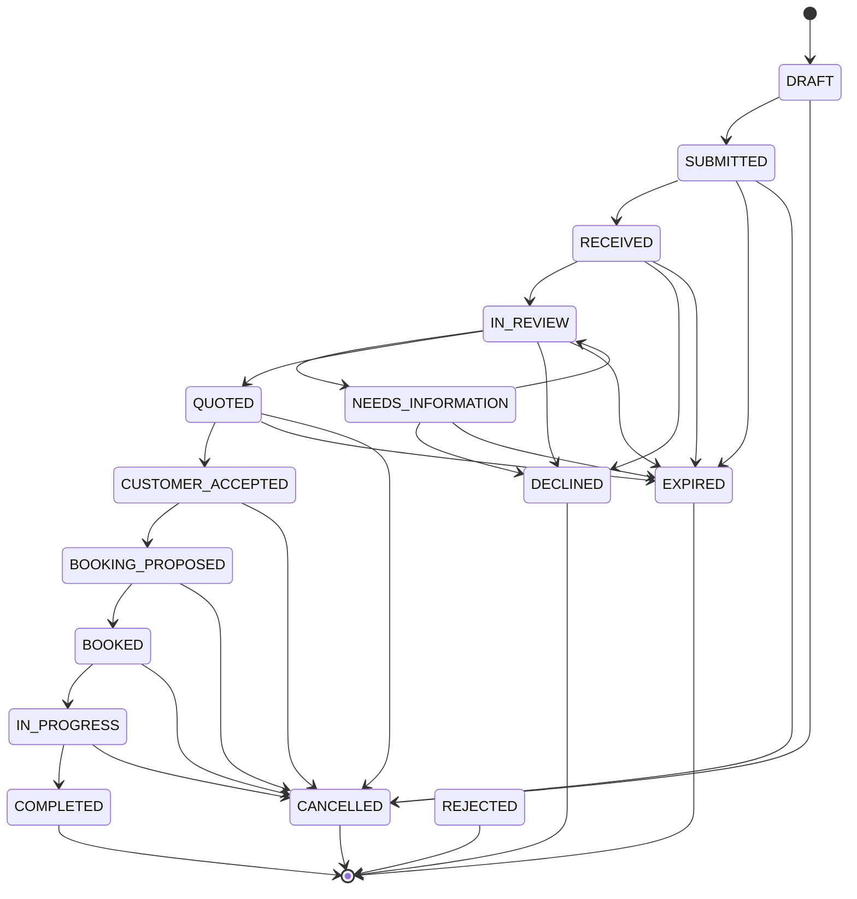
```mermaid
stateDiagram-v2
    [*] --> DRAFT
    DRAFT --> SUBMITTED
    DRAFT --> CANCELLED
    SUBMITTED --> RECEIVED
    SUBMITTED --> EXPIRED
    SUBMITTED --> CANCELLED
    RECEIVED --> IN_REVIEW
    RECEIVED --> DECLINED
    RECEIVED --> EXPIRED
    IN_REVIEW --> NEEDS_INFORMATION
    IN_REVIEW --> QUOTED
    IN_REVIEW --> DECLINED
    IN_REVIEW --> EXPIRED
    NEEDS_INFORMATION --> IN_REVIEW
    NEEDS_INFORMATION --> DECLINED
    NEEDS_INFORMATION --> EXPIRED
    QUOTED --> CUSTOMER_ACCEPTED
    QUOTED --> EXPIRED
    QUOTED --> CANCELLED
    CUSTOMER_ACCEPTED --> BOOKING_PROPOSED
    CUSTOMER_ACCEPTED --> CANCELLED
    BOOKING_PROPOSED --> BOOKED
    BOOKING_PROPOSED --> CANCELLED
    BOOKED --> IN_PROGRESS
    BOOKED --> CANCELLED
    IN_PROGRESS --> COMPLETED
    IN_PROGRESS --> CANCELLED
    COMPLETED --> [*]
    DECLINED --> [*]
    CANCELLED --> [*]
    EXPIRED --> [*]
    REJECTED --> [*]
```

### Quote State Machine

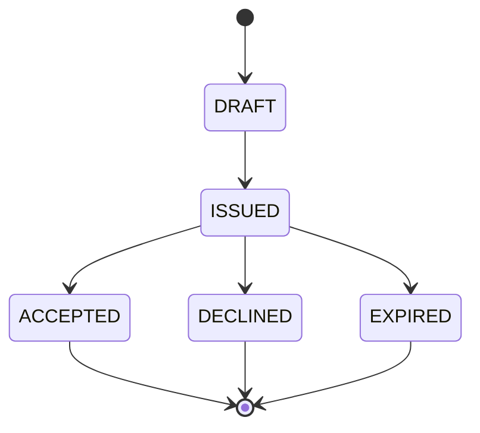
```mermaid
stateDiagram-v2
    [*] --> DRAFT
    DRAFT --> ISSUED
    ISSUED --> ACCEPTED
    ISSUED --> DECLINED
    ISSUED --> EXPIRED
    ACCEPTED --> [*]
    DECLINED --> [*]
    EXPIRED --> [*]
```

### Booking State Machine

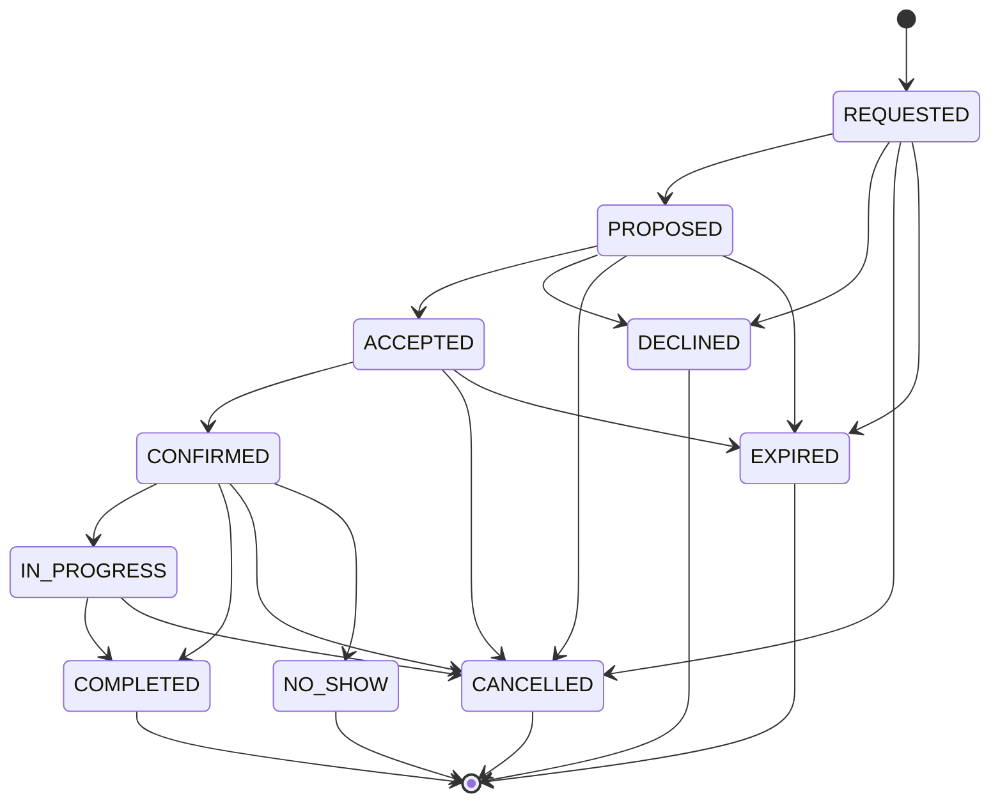
```mermaid
stateDiagram-v2
    [*] --> REQUESTED
    REQUESTED --> PROPOSED
    REQUESTED --> DECLINED
    REQUESTED --> CANCELLED
    REQUESTED --> EXPIRED
    PROPOSED --> ACCEPTED
    PROPOSED --> DECLINED
    PROPOSED --> CANCELLED
    PROPOSED --> EXPIRED
    ACCEPTED --> CONFIRMED
    ACCEPTED --> CANCELLED
    ACCEPTED --> EXPIRED
    CONFIRMED --> IN_PROGRESS
    CONFIRMED --> COMPLETED
    CONFIRMED --> CANCELLED
    CONFIRMED --> NO_SHOW
    IN_PROGRESS --> COMPLETED
    IN_PROGRESS --> CANCELLED
    COMPLETED --> [*]
    DECLINED --> [*]
    CANCELLED --> [*]
    EXPIRED --> [*]
    NO_SHOW --> [*]
```

### Brain Version State Machine

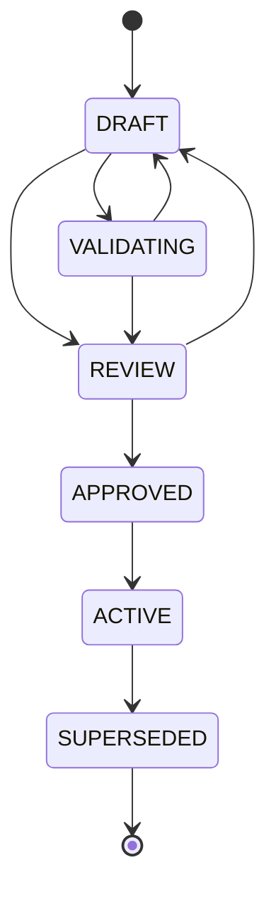
```mermaid
stateDiagram-v2
    [*] --> DRAFT
    DRAFT --> VALIDATING
    DRAFT --> REVIEW
    VALIDATING --> REVIEW
    VALIDATING --> DRAFT
    REVIEW --> APPROVED
    REVIEW --> DRAFT
    APPROVED --> ACTIVE
    ACTIVE --> SUPERSEDED
    SUPERSEDED --> [*]
```

### Payment State Machine

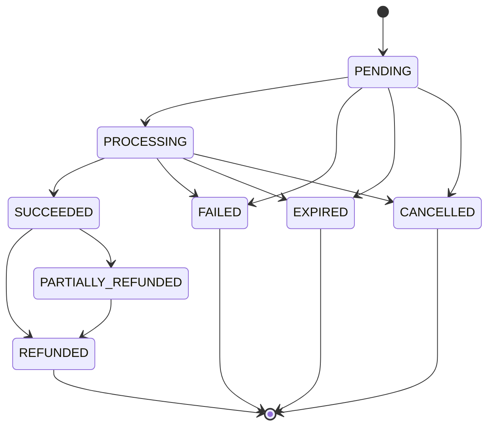
```mermaid
stateDiagram-v2
    [*] --> PENDING
    PENDING --> PROCESSING
    PENDING --> FAILED
    PENDING --> EXPIRED
    PENDING --> CANCELLED
    PROCESSING --> SUCCEEDED
    PROCESSING --> FAILED
    PROCESSING --> EXPIRED
    PROCESSING --> CANCELLED
    SUCCEEDED --> REFUNDED
    SUCCEEDED --> PARTIALLY_REFUNDED
    PARTIALLY_REFUNDED --> REFUNDED
    REFUNDED --> [*]
    FAILED --> [*]
    EXPIRED --> [*]
    CANCELLED --> [*]
```
